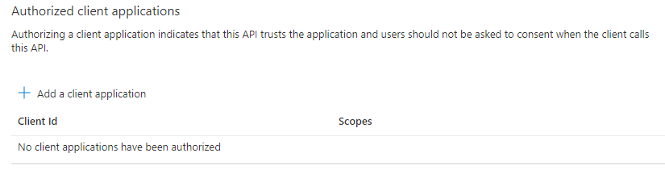

# Authorized Client Applications

## Why

When users try to access the web api in the flow above they will be met with a prompt like this

Users may only access this api when the request has been approved by an admin, however, the second option is to <b>add</b> our client app (portal) as a trusted application for the web api (DLS in our case).

## How

Navigate to the DLS app registration - Expose an API

Add the client id for the client app to this list, and select one or multiple scopes that this client app should be able to delegate access for.

Now any users that have the appropriate RBAC role(s)/are part of the right Ad group can access the API without needing to request access and await approval (it may take a few minutes for Azure to apply the changes). The trusted client app can be removed at any time, which will resort to the old behaviour.

## Conclusion

This approach reduces unnecessary administrative overhead, and also maintains proper access control, the trusted apps can be removed at any time. However, the client app should ensure that access tokens are invalidated frequently, because if access is revoked, prior created access tokens will still be valid until they expire.
